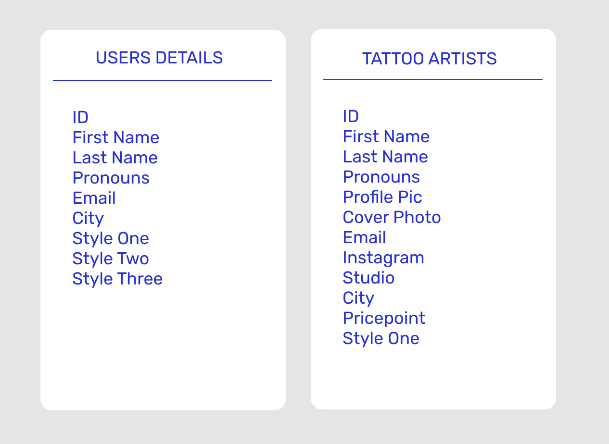

# InkedIn - Kezi Rose MVP

## Summary

An app that matches user with their idea tattoo artists (so far based on city and favourite 3 styles)

## Table of Contents
1. Setting Up
2. Database Schema
3. Future Features

## Installation instructions

### 1: Setting up your local repository

1. Fork the repo into your GitHub. Copy the address and run git clone to save a local version on your computer.
2. In the terminal, cd into the project folder. Run 'yarn' to install dependencies.
3. cd into the client folder. Run 'yarn' to install dependencies.
4. cd back into the project folder. Create a .env folder with the following content (change the password if you used a different password for MySQL):
DB_HOST=localhost
DB_USER=root
DB_PASS=root
DB_NAME=mvp
5. Run 'yarn migrate' to fill the database with dummy information.
6. In the project folder, run 'yarn start' to start the server.
7. cd into the client folder. Run 'yarn start' to start the client app.

## 2: Database Schema

Before the user form PUTs/modifies the user details, their city and styles are set to null

## Future Features

- Artist profiles with portfolio and messaging option
- Artist profiles with portfolio and map integration
- More filters
- Adapting database so users can favourite artists to their dashboard and remove from dashboard too

_This is a student project that was created at [CodeOp](http://codeop.tech), a full stack development bootcamp in Barcelona._